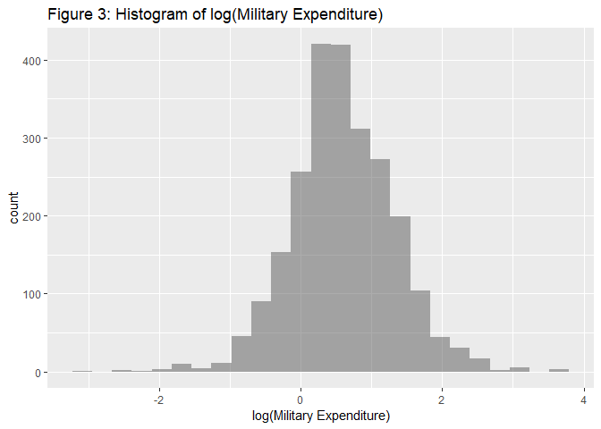
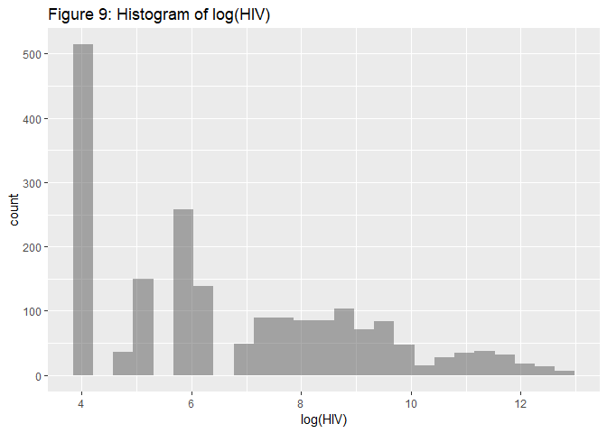

Metrics Final Project: Code
================
Noam Benkler
May 14, 2018

#### Table of Contents

[Abstract](#Abstract)

[Research Question and Hypothesis](#Research_Question_and_Hypothesis)

[Theory](#Theory)

[Previous Work](#Previous_Work)

[Data Description and Visualization](#Data_Description_and_Visualization)

[Econometric Model and Basic Results](#Econometric_Model_and_Basic_Results)

[Robustness](#Robustness)

[Limitations and Future Work](#Limitations_and_Future_Work)

[Appendix](#Appendix)

[Bibliography](#Bibliography)

Abstract
-----------------------------

The political debate over how much to spend on military funding grows more heated as President Trump plans to increase the defense budget. This essay seeks to determine effects that military expenditures may have on life expectancy. We hypothesize that increases in military expenditures correspond to decreases in life expectancy and find that there is a statistically significant (p&lt;0.01) negative relationship between life expectancy and military expenditures. We find that a 1% increase in a country's military expenditures is associated with a 0.623 year drop in that country's mean life expectancy. Using r studio, we perform exploratory analysis on our data and regress life expectancy against military expenditures, GDP, healthcare expenditures, and mean years in school for men. We conduct tests for significance, heteroskedasticity, correlation, and autocorrelation to determine the accuracy and value of our results. The data is compiled from Gapminder (<https://www.gapminder.org/data/>) and cleaned in r studio.

Research Question and Hypothesis
-----------------------------------------------------------------------------

In this paper we consider the relationship between life expectancy and military expenditures. How does a country’s life expectancy change based on their military expenditure? Considering GDP, mean years in school, and healthcare expenditures allows one to more precisely estimate the effect of military expenditure on life expectancy. We hypothesize that increases in military expenditures correspond to decreases in life expectancy. We are aware of the positive relationship between increased GDP and increased life expectancy and we know that an increase in military expenditure does not increase GDP. Thus, we believe that an increase in military expenditure would not increase life expectancy. Additionally, an increased military expenditure could suggest that the country is experiencing more war and violence, therefore resulting in a higher mortality rate and decreasing their life expectancy.

Theory
-------------------------

According to the Keynesian model, increases in government spending increases GDP and serves as a pillar of support during financial crisis. Moreover, government spending towards military has a smaller multiplier effect than spending directly into infrastructure, unemployment benefits, and education. Therefore, the benefits to GDP are mitigated. GDP is positively related to life expectancy, consequently the negative relationship between military spending and life expectancy could lead to inefficiency of investing government spending on military funding.

Previous Work
---------------------------------------

The relationship between military expenditure and life expectancy has not been heavily studied. However, by understanding the relationship between life expectancy and GDP and between GDP and military expenditure, we can hypothesize the relationship between life expectancy and military expenditure. Kentor and Kick (2008) examine the effect that military expenditures per soldier have on per capita GDP growth in a variety of countries. They find that military expenditures inhibit the growth of per capita GDP, and that the effect is more pronounced in less developed countries. Additionally, the labor force expansion is slowed and the available investment capital goes towards the military rather than more productive economic opportunities. Mahumud et al. (2013) provide evidence to suggest that an increase in GDP is correlated with an increase in life expectancy. Therefore, the decrease in GDP growth seen in Kentor and Kick (2008) due to increased military expenditure could cause decreases in life expectancy.

Kentor and Jorgenson (2017) examined the effect that increased military expenditures in high-tech, capital-intensive armaments had on the under- five mortality rate and life expectancy. This study uses cross-national panel models to determine that increases in military expenditures increase the under-five mortality rate and decreases life expectancy. The study cites potential reasons for decreases in life expectancy. For instance, increases in expenditures decrease the number and type of soldiers able to take advantage of health-related resources and increase income inequality.

Data Description and Visualization
---------------------------------------------------------------------------------

Our data set consisted of 2,403 observations on 9 quantitative variables and 2 categorical variables: country (the country in question), continent (the continent to which a country belongs), year (the year to which the data applied), militaryexpenditures (the % of GDP a country spends on their military), lifeExp (average life expectancy in years), GDPpercap (GDP per capita in US dollars), GDP (GDP in billions of US dollars), HIV (the number of deaths due to HIV), healthcare (per capita total expenditure on health in US dollars), womenEd (the mean number of years spent in school for women over the age of 25), and menEd (the mean number of years spent in school for men over the age of 25). A summary of all the quantitative variables can be seen in Table 1.

    Table 1: Summary Statistics of Dataset
    =================================================================================================================
    Statistic              N       Mean       St. Dev.      Min     Pctl(25)     Median      Pctl(75)        Max     
    -----------------------------------------------------------------------------------------------------------------
    year                 2,403   2,002.9        4.8        1,995      1,999       2,003       2,007         2,011    
    militaryexpenditures 2,403     2.4          2.4        0.05        1.2         1.7         2.9          39.6     
    lifeExp              2,403     68.9         9.5        37.6       62.3        71.8         76.3         82.7     
    GDPpercap            2,375 13,850,537.0 20,198,440.0 170,565.2 1,116,284.0 3,990,565.0 16,220,786.0 112,570,554.0
    GDP                  2,379  485,877.8   2,006,148.0    371.8     9,103.6    35,301.5    239,048.2   23,488,439.0 
    HIV                  1,985   11,965.3     37,408.0     60.0       60.0        600.0      5,200.0      390,000.0  
    healthcare           2,241    697.0       1,272.0       2.0       36.9        151.7       626.3        8,361.7   
    womenEd              2,005     6.7          3.8         0.3        3.3         6.6         10.1         14.2     
    menEd                2,005     7.7          3.2         0.8        5.2         7.6         10.6         14.2     
    -----------------------------------------------------------------------------------------------------------------

Histograms of each of the quantitative variables show strong skewness in all quantitative variables other than Life Expectancy, Men's Education, and Women's education. Logging these variables improves the normality of all these variables other than HIV. Histograms of all the variables and the necessary log-transformations can be seen in figures 1-13. 

Figures 14 through 20 show plots of each variable against life expectancy. All of the variables other than HIV and Military Expenditures appeared to have definite associations with Life Expectancy. We decided to test whether or not there was any association between countries' military expenditures and their mean life expectancy.

Econometric Model and Basic Results
-----------------------------------------------------------------------------------

To begin with, we create a model excluding the variables GDPpercapita, HIV, and womensEd due to problems with multicollinearity and normality (for explanation see Appendix part: "Model selection") and conduct a Hausman test in order to see whether it's necessary for us to model our data using a fixed effects model accounting for country as a factor or whether a pooled model would be sufficient. The results are shown in Tables 2 and 3.

    Table 2: Regression summary for Pooled, Fixed Effects, and Random Effects models
    =======================================================================================================
                                                           Dependent variable:                             
                              -----------------------------------------------------------------------------
                                                                 lifeExp                                   
                                       Pooled                 Fixed Effects            Random Effects      
                                         (1)                       (2)                       (3)           
    -------------------------------------------------------------------------------------------------------
    log(militaryexpenditures)           0.215                   -0.692***                 -0.641***        
                                       (0.177)                   (0.142)                   (0.140)         
                                                                                                           
    log(GDP)                          0.663***                  3.850***                  1.961***         
                                       (0.077)                   (0.390)                   (0.214)         
                                                                                                           
    log(healthcare)                   2.691***                  0.602***                  0.996***         
                                       (0.117)                   (0.146)                   (0.129)         
                                                                                                           
    menEd                             0.706***                    0.129                   0.639***         
                                       (0.058)                   (0.142)                   (0.108)         
                                                                                                           
    Constant                          42.289***                                           37.990***        
                                       (0.639)                                             (1.794)         
                                                                                                           
    -------------------------------------------------------------------------------------------------------
    Observations                        1,949                     1,949                     1,949          
    R2                                  0.657                     0.354                     0.435          
    Adjusted R2                         0.656                     0.300                     0.434          
    F Statistic               931.259*** (df = 4; 1944) 246.460*** (df = 4; 1798) 374.557*** (df = 4; 1944)
    =======================================================================================================
    Note:                                                                       *p<0.1; **p<0.05; ***p<0.01

    Table 3: Output of Hausman Test
    ===================================================
    Statistic N Mean St. Dev. Min Pctl(25) Pctl(75) Max
    ===================================================

With a p-value ≈ 0 we have sufficient evidence to conclude that a pooled model would be insufficient. We arrive at the fixed effects model: *l**i**f**e**E**x**p* = *β*0 + *β*1*f**a**c**t**o**r*(*c**o**u**n**t**r**y*)+*β*2*l**o**g*(*m**i**l**i**t**a**r**y**E**x**p*)+*β*3*l**o**g*(*G**D**P*)+*β*4*l**o**g*(*h**e**a**l**t**h**c**a**r**e*)+*m**e**n**E**d*).

We remain confident in this model despite its markedly high VIF statistics (Table 5) because of low VIF values between all the explanatory variables in a pooled version of the same model (Table 4). Given this we surmise the increase in the VIF statistics is due to the collinear relationship between the factor variable and all the other variables. Moreover, We choose to treat data point 737 as a potential outlier and remove it from our model because of its significant Cook's distance (Figure 21).

    Table 4: VIF values for Model without factor(country)
    ========================================================
    log(militaryexpenditures) log(GDP) log(healthcare) menEd
    --------------------------------------------------------
    1.017                      1.779        2.827      2.143
    --------------------------------------------------------

    Table 5: VIF statistics for Fixed Effects Model
    ====================================================
                                  GVIF      Df  GVIFDf))
    ----------------------------------------------------
    log(militaryexpenditures)     8.890      1   2.982  
    log(GDP)                     626.954     1   25.039 
    log(healthcare)              59.847      1   7.736  
    menEd                        174.374     1   13.205 
    factor(country)           2,869,344.000 146  1.052  
    ----------------------------------------------------

    Table 6: Model Coefficients for Final Fixed Effects Model (In Both GLM and PLM Form)
    ==============================================================
                                      Dependent variable:         
                              ------------------------------------
                                            lifeExp               
                                normal             panel          
                                                  linear          
                                 (1)                (2)           
    --------------------------------------------------------------
    log(militaryexpenditures) -0.623***          -0.623***        
                               (0.136)            (0.136)         
                                                                  
    log(GDP)                   3.665***          3.665***         
                               (0.373)            (0.373)         
                                                                  
    log(healthcare)            0.636***          0.636***         
                               (0.140)            (0.140)         
                                                                  
    menEd                       0.183              0.183          
                               (0.136)            (0.136)         
                                                                  
    Constant                  37.959***                           
                               (2.375)                            
                                                                  
    --------------------------------------------------------------
    Observations                1,948              1,948          
    R2                                             0.372          
    Adjusted R2                                    0.320          
    Log Likelihood            -3,392.908                          
    Akaike Inf. Crit.         7,087.815                           
    F Statistic                          266.678*** (df = 4; 1797)
    ==============================================================
    Note:                              *p<0.1; **p<0.05; ***p<0.01

    Table 7: Confidence Interval for the Coefficient of log(militaryexpenditures)
    =============
    0.5 %  99.5 %
    -------------
    -0.973 -0.273
    -------------

Our final fixed effects model suggests that all else held constant, a 1% increase in a country's military expenditures is associated with a 0.623 year drop in that country's mean life expectancy, with a standard error of 0.136 that implies our coefficient is significantly different from 0 (over 4.58 times the SE away). All else set equal to 0 the average life expectancy in each country is 38.0 years + whatever *β*1*f**a**c**t**o**r*(*c**o**u**n**t**r**y*) is for each country (can be seen in Appendix Table 13). With 99% confidence the true mean coefficient of log(militaryexpenditures) is between -0.973 and -0.273. Furthermore, if we were to repeat this experiment over and over then we would expect that 99% percent of confidence intervals constructed this way would contain the true mean coefficient of log(militaryexpenditures). Finally, we find that our model explained approximately 32.0% of the variation in Y. 

Despite the significant slope coefficeint for *β*2, our plot of the military expenditures against life expectancy (Figure 22) shows little indication of any relationship between the two variables. The residuals plot of our model (Figure 23) shows strong evidence of heteroskedasticity.

Robustness
---------------------------------

In order to test the robustness of our model we first look at correcting the apparent heteroskedasticity in our fixed model. To do so, we conduct a Breusch-Pagan tests for heteroskedasticity which gives a p-value ≈ 0 (Table 8) indicating significant heteroskedasticity in our model

    Table 8: Results of Breusch-Pagan test
    ===================================================
    Statistic N Mean St. Dev. Min Pctl(25) Pctl(75) Max
    ===================================================

Given the apparent heteroskedasticity in our model we compare our fixed effects model's standard errors to the robust standard errors and OLS standard errors in order to determine whether or not we need to adjust our standard errors to account for heteroskedasticity. We find that we do not need to adjust our standard errors because they are similar to one another and do not influence the significance of the model.

    Table 9: Model Coefficients and Errors for OLS, Fixed Model, and White's Model
    ============================================================
                                     Dependent variable:        
                              ----------------------------------
                               lifeExp                          
                                 OLS     hccm default hccm White
                                 (1)         (2)         (3)    
    ------------------------------------------------------------
    log(militaryexpenditures) -0.623***     -0.623    -0.623*** 
                               (0.136)                 (0.162)  
                                                                
    log(GDP)                   3.665***     3.665      3.665*** 
                               (0.373)                 (0.486)  
                                                                
    log(healthcare)            0.636***     0.636      0.636*** 
                               (0.140)                 (0.143)  
                                                                
    menEd                       0.183       0.183       0.183   
                               (0.136)                 (0.199)  
                                                                
    Constant                  37.959***     37.959    37.959*** 
                               (2.375)                 (2.961)  
                                                                
    ------------------------------------------------------------
    Observations                1,948                           
    Log Likelihood            -3,392.908                        
    Akaike Inf. Crit.         7,087.815                         
    ============================================================
    Note:                            *p<0.1; **p<0.05; ***p<0.01

To test whether our model showed signs of auto correlation we conduct a Durbin-Watson test on our model, which gives us a p-value of 0.97 (Table 10), thus we cannot reject the null hypothesis of the model having an autocorrelation value equal to 0.

    Table 10: Results of Durbin-Watson test
    ===================================================
    Statistic N Mean St. Dev. Min Pctl(25) Pctl(75) Max
    ===================================================

Regarding the estimation of other models, we find that using a pooled model for our data would be insufficient (Table 3). Though using a stepwise selection process on all of the variables included in our dataset provide a different model then ours (Table 11), with a higher *R*2 value (0.817), we believe our model is more accurate becasue the stepwise model does not take country into account as an influential factor, which our Hausman test determines to be the case. Furthermore, the vif values for the new model (Table 12) show that log(GDP) and log(GDPpercapita) are not highly correlated with one another, which we believe to be innacurate. Finally, based on Figures 9 and 17 we do not believe using the variable HIV is conducive to finding an accurate model.

    Table 11: Model Coefficients for Stepwise Model
    =====================================================
                                  Dependent variable:    
                              ---------------------------
                                        lifeExp          
    -----------------------------------------------------
    log(GDPpercap)                     1.285***          
                                        (0.128)          
                                                         
    log(HIV)                           -1.854***         
                                        (0.060)          
                                                         
    log(GDP)                           1.922***          
                                        (0.080)          
                                                         
    year                               0.187***          
                                        (0.025)          
                                                         
    menEd                              0.229***          
                                        (0.048)          
                                                         
    log(militaryexpenditures)          -0.541***         
                                        (0.150)          
                                                         
    Constant                          -335.945***        
                                       (49.179)          
                                                         
    -----------------------------------------------------
    Observations                         1,663           
    R2                                   0.818           
    Adjusted R2                          0.817           
    Residual Std. Error            4.165 (df = 1656)     
    F Statistic               1,237.982*** (df = 6; 1656)
    =====================================================
    Note:                     *p<0.1; **p<0.05; ***p<0.01

    Table 12: VIF values for Stepwise Model
    ======================================================================
    log(GDPpercap) log(HIV) log(GDP) year  menEd log(militaryexpenditures)
    ----------------------------------------------------------------------
    4.164           1.932    2.964   1.064 2.348           1.027          
    ----------------------------------------------------------------------

Limitations and Future Work
-------------------------------------------------------------------

Our model is far from perfect. The variables we use cannot fully explain the changes we see in life expectancy across countries. We fail to account for the different types of military expenditure, such as technology or wages, as different countries could be allocating their expenditure differently. We also fail to account for countries that are at war. A country that goes to war will increase their military spending and we would expect a country at war to have a lower life expectancy than their norm. This is likely pushing our coefficient on military spending to be more negative. Additionally, as we use military expenditure as a percentage of GDP, a country with a small GDP at war or with its neighbors at war will have a significantly inflated military expenditure. There may also be more advanced models that we failed to consider when analyzing our data. We also fail to take into account inter-country relationships that may skew the data. If we were to do this experiment again, we might have looked more closely into the stepwise model, and tried several other model selection processees to determine whether a different combination of variables could have resulted in a more accurate model.

If we were to conduct further research on this subject, there are a variety of ideas and variables that would be valuable to consider. Adding utility to the model could help us understand whether military expenditures affected countries in ways other than life expectancy. It would also be interesting to consider how the model changes when a country is at peace versus in active conflict, and how the mortality rate for men aged 18 to 30 changes with both war and increased military expenditure. Considering intra-country violence and crime could allow us to consider how much of a country’s military efforts are focused within its own borders. This could also allow an interesting comparison of wage expenditure versus technological expenditure. Including a dummy variable for first and third world countries could also create an interesting relationship between the amount that a country spend on military and their level of development. These variables would allow us to create a more precise model of what parts of military expenditure affect life expectancy and how countries could use this data to further growth.

Appendix
-----------------------------

    Table 13: Additional Effect of factor(country) on Constant
    =================================================================
                                              Dependent variable:    
                                          ---------------------------
                                                    lifeExp          
    -----------------------------------------------------------------
    factor(country)Algeria                         -9.846***         
                                                    (1.667)          
                                                                     
    factor(country)Angola                         -23.179***         
                                                    (1.152)          
                                                                     
    factor(country)Argentina                      -17.845***         
                                                    (1.606)          
                                                                     
    factor(country)Armenia                         -1.729***         
                                                    (0.626)          
                                                                     
    factor(country)Australia                      -14.515***         
                                                    (1.463)          
                                                                     
    factor(country)Austria                        -13.642***         
                                                    (1.183)          
                                                                     
    factor(country)Azerbaijan                     -10.026***         
                                                    (0.604)          
                                                                     
    factor(country)Bahrain                         -3.369***         
                                                    (0.703)          
                                                                     
    factor(country)Belarus                        -12.053***         
                                                    (0.634)          
                                                                     
    factor(country)Belgium                        -14.441***         
                                                    (1.244)          
                                                                     
    factor(country)Belize                           -0.170           
                                                    (0.743)          
                                                                     
    factor(country)Benin                          -13.814***         
                                                    (0.943)          
                                                                     
    factor(country)Bolivia                         -8.956***         
                                                    (0.736)          
                                                                     
    factor(country)Bosnia and Herzegovina           -0.841           
                                                    (0.676)          
                                                                     
    factor(country)Botswana                       -25.550***         
                                                    (0.955)          
                                                                     
    factor(country)Brazil                         -22.962***         
                                                    (2.228)          
                                                                     
    factor(country)Bulgaria                        -8.380***         
                                                    (0.627)          
                                                                     
    factor(country)Burkina Faso                   -17.484***         
                                                    (1.122)          
                                                                     
    factor(country)Burundi                        -16.199***         
                                                    (0.751)          
                                                                     
    factor(country)Cambodia                       -11.904***         
                                                    (0.829)          
                                                                     
    factor(country)Cameroon                       -22.390***         
                                                    (0.970)          
                                                                     
    factor(country)Canada                         -17.807***         
                                                    (1.471)          
                                                                     
    factor(country)Cape Verde                        1.330           
                                                    (0.816)          
                                                                     
    factor(country)Chad                           -17.020***         
                                                    (0.933)          
                                                                     
    factor(country)Chile                           -9.455***         
                                                    (1.148)          
                                                                     
    factor(country)China                          -25.152***         
                                                    (2.516)          
                                                                     
    factor(country)Colombia                       -12.805***         
                                                    (1.602)          
                                                                     
    factor(country)Congo, Dem. Rep.               -19.005***         
                                                    (0.763)          
                                                                     
    factor(country)Congo, Rep.                    -17.918***         
                                                    (0.674)          
                                                                     
    factor(country)Cote d'Ivoire                  -23.573***         
                                                    (1.203)          
                                                                     
    factor(country)Croatia                         -7.811***         
                                                    (0.728)          
                                                                     
    factor(country)Cuba                            -7.082***         
                                                    (0.979)          
                                                                     
    factor(country)Cyprus                          -1.614***         
                                                    (0.568)          
                                                                     
    factor(country)Denmark                        -14.300***         
                                                    (1.040)          
                                                                     
    factor(country)Djibouti                        -5.695***         
                                                    (0.749)          
                                                                     
    factor(country)Ecuador                         -6.867***         
                                                    (0.896)          
                                                                     
    factor(country)Egypt                          -16.844***         
                                                    (1.558)          
                                                                     
    factor(country)El Salvador                     -7.608***         
                                                    (0.905)          
                                                                     
    factor(country)Equatorial Guinea              -15.357***         
                                                    (1.615)          
                                                                     
    factor(country)Eritrea                         -6.251***         
                                                    (0.863)          
                                                                     
    factor(country)Estonia                         -6.756***         
                                                    (0.536)          
                                                                     
    factor(country)Ethiopia                       -20.804***         
                                                    (1.403)          
                                                                     
    factor(country)Fiji                            -7.577***         
                                                    (0.592)          
                                                                     
    factor(country)Finland                        -12.090***         
                                                    (1.063)          
                                                                     
    factor(country)France                         -18.891***         
                                                    (1.987)          
                                                                     
    factor(country)Gabon                          -16.273***         
                                                    (0.750)          
                                                                     
    factor(country)Gambia                          -4.004***         
                                                    (0.814)          
                                                                     
    factor(country)Georgia                         -3.590***         
                                                    (0.655)          
                                                                     
    factor(country)Germany                        -21.993***         
                                                    (1.927)          
                                                                     
    factor(country)Ghana                          -15.188***         
                                                    (0.708)          
                                                                     
    factor(country)Greece                         -10.519***         
                                                    (1.217)          
                                                                     
    factor(country)Guatemala                      -11.570***         
                                                    (1.280)          
                                                                     
    factor(country)Guinea                         -17.558***         
                                                    (1.074)          
                                                                     
    factor(country)Guinea-Bissau                   -9.450***         
                                                    (0.933)          
                                                                     
    factor(country)Guyana                          -4.537***         
                                                    (0.794)          
                                                                     
    factor(country)Haiti                          -17.942***         
                                                    (1.744)          
                                                                     
    factor(country)Honduras                        -6.556***         
                                                    (0.955)          
                                                                     
    factor(country)Hungary                        -13.557***         
                                                    (0.880)          
                                                                     
    factor(country)India                          -28.953***         
                                                    (2.338)          
                                                                     
    factor(country)Indonesia                      -20.705***         
                                                    (1.869)          
                                                                     
    factor(country)Iran                           -15.525***         
                                                    (1.619)          
                                                                     
    factor(country)Iraq                           -14.175***         
                                                    (1.193)          
                                                                     
    factor(country)Ireland                        -11.367***         
                                                    (1.113)          
                                                                     
    factor(country)Israel                         -10.050***         
                                                    (1.077)          
                                                                     
    factor(country)Italy                          -17.788***         
                                                    (1.918)          
                                                                     
    factor(country)Jamaica                         -4.557***         
                                                    (0.618)          
                                                                     
    factor(country)Japan                          -22.733***         
                                                    (2.278)          
                                                                     
    factor(country)Jordan                          -3.944***         
                                                    (0.629)          
                                                                     
    factor(country)Kazakhstan                     -17.083***         
                                                    (0.756)          
                                                                     
    factor(country)Kenya                          -20.968***         
                                                    (0.974)          
                                                                     
    factor(country)Kuwait                          -6.688***         
                                                    (1.234)          
                                                                     
    factor(country)Latvia                          -9.177***         
                                                    (0.544)          
                                                                     
    factor(country)Lebanon                         -4.831***         
                                                    (0.876)          
                                                                     
    factor(country)Lesotho                        -18.415***         
                                                    (0.667)          
                                                                     
    factor(country)Liberia                         -8.924***         
                                                    (0.765)          
                                                                     
    factor(country)Lithuania                       -9.383***         
                                                    (0.579)          
                                                                     
    factor(country)Luxembourg                      -5.670***         
                                                    (0.676)          
                                                                     
    factor(country)Macedonia, FYR                  -1.966***         
                                                    (0.561)          
                                                                     
    factor(country)Madagascar                     -13.236***         
                                                    (0.857)          
                                                                     
    factor(country)Malawi                         -23.480***         
                                                    (0.685)          
                                                                     
    factor(country)Malaysia                       -13.313***         
                                                    (1.444)          
                                                                     
    factor(country)Mali                           -16.419***         
                                                    (1.069)          
                                                                     
    factor(country)Mauritania                      -4.424***         
                                                    (0.871)          
                                                                     
    factor(country)Mauritius                       -5.555***         
                                                    (0.672)          
                                                                     
    factor(country)Mexico                         -20.043***         
                                                    (2.027)          
                                                                     
    factor(country)Moldova                         -3.396***         
                                                    (0.706)          
                                                                     
    factor(country)Mongolia                        -7.350***         
                                                    (0.594)          
                                                                     
    factor(country)Montenegro                      3.210***          
                                                    (1.091)          
                                                                     
    factor(country)Morocco                        -10.410***         
                                                    (1.550)          
                                                                     
    factor(country)Mozambique                     -20.996***         
                                                    (1.064)          
                                                                     
    factor(country)Namibia                        -18.989***         
                                                    (0.719)          
                                                                     
    factor(country)Netherlands                    -15.651***         
                                                    (1.434)          
                                                                     
    factor(country)New Zealand                     -8.403***         
                                                    (0.809)          
                                                                     
    factor(country)Nicaragua                         1.172           
                                                    (0.792)          
                                                                     
    factor(country)Niger                          -16.722***         
                                                    (1.084)          
                                                                     
    factor(country)Nigeria                        -27.562***         
                                                    (1.471)          
                                                                     
    factor(country)Norway                         -12.700***         
                                                    (1.027)          
                                                                     
    factor(country)Oman                            -4.928***         
                                                    (1.142)          
                                                                     
    factor(country)Pakistan                       -20.957***         
                                                    (1.776)          
                                                                     
    factor(country)Panama                          -3.614***         
                                                    (0.873)          
                                                                     
    factor(country)Papua New Guinea               -16.217***         
                                                    (0.867)          
                                                                     
    factor(country)Paraguay                        -3.403***         
                                                    (0.791)          
                                                                     
    factor(country)Peru                            -9.909***         
                                                    (1.156)          
                                                                     
    factor(country)Philippines                    -16.692***         
                                                    (1.413)          
                                                                     
    factor(country)Poland                         -16.236***         
                                                    (1.247)          
                                                                     
    factor(country)Portugal                       -11.185***         
                                                    (1.488)          
                                                                     
    factor(country)Qatar                           -7.035***         
                                                    (1.091)          
                                                                     
    factor(country)Romania                        -13.172***         
                                                    (0.889)          
                                                                     
    factor(country)Russia                         -25.290***         
                                                    (1.471)          
                                                                     
    factor(country)Rwanda                         -16.477***         
                                                    (0.794)          
                                                                     
    factor(country)Saudi Arabia                   -11.861***         
                                                    (1.675)          
                                                                     
    factor(country)Senegal                        -13.397***         
                                                    (1.085)          
                                                                     
    factor(country)Serbia                          -4.757***         
                                                    (0.569)          
                                                                     
    factor(country)Seychelles                       2.361**          
                                                    (0.954)          
                                                                     
    factor(country)Sierra Leone                   -15.864***         
                                                    (0.829)          
                                                                     
    factor(country)Singapore                       -8.680***         
                                                    (1.402)          
                                                                     
    factor(country)Slovak Republic                -10.489***         
                                                    (0.722)          
                                                                     
    factor(country)Slovenia                        -6.637***         
                                                    (0.634)          
                                                                     
    factor(country)South Africa                   -32.849***         
                                                    (1.524)          
                                                                     
    factor(country)Spain                          -15.722***         
                                                    (1.909)          
                                                                     
    factor(country)Sri Lanka                       -6.565***         
                                                    (0.880)          
                                                                     
    factor(country)Sudan                          -14.613***         
                                                    (1.172)          
                                                                     
    factor(country)Swaziland                      -22.856***         
                                                    (0.629)          
                                                                     
    factor(country)Sweden                         -12.996***         
                                                    (1.243)          
                                                                     
    factor(country)Switzerland                    -13.443***         
                                                    (1.124)          
                                                                     
    factor(country)Syria                           -5.203***         
                                                    (1.096)          
                                                                     
    factor(country)Tajikistan                      -2.765***         
                                                    (0.859)          
                                                                     
    factor(country)Tanzania                       -21.229***         
                                                    (1.108)          
                                                                     
    factor(country)Thailand                       -15.814***         
                                                    (1.672)          
                                                                     
    factor(country)Timor-Leste                     4.334***          
                                                    (0.997)          
                                                                     
    factor(country)Togo                           -12.252***         
                                                    (0.851)          
                                                                     
    factor(country)Trinidad and Tobago             -8.681***         
                                                    (1.523)          
                                                                     
    factor(country)Tunisia                         -6.270***         
                                                    (1.014)          
                                                                     
    factor(country)Turkey                         -16.242***         
                                                    (1.820)          
                                                                     
    factor(country)Turkmenistan                    -8.783***         
                                                    (0.799)          
                                                                     
    factor(country)Uganda                         -24.058***         
                                                    (0.899)          
                                                                     
    factor(country)Ukraine                        -15.780***         
                                                    (0.900)          
                                                                     
    factor(country)United Arab Emirates           -14.074***         
                                                    (1.346)          
                                                                     
    factor(country)United Kingdom                 -21.061***         
                                                    (1.818)          
                                                                     
    factor(country)United States                  -29.493***         
                                                    (2.369)          
                                                                     
    factor(country)Uruguay                         -7.535***         
                                                    (0.815)          
                                                                     
    factor(country)Uzbekistan                     -12.014***         
                                                    (0.803)          
                                                                     
    factor(country)Venezuela                      -14.663***         
                                                    (1.471)          
                                                                     
    factor(country)Vietnam                         -9.849***         
                                                    (1.290)          
                                                                     
    factor(country)Zambia                         -26.187***         
                                                    (0.677)          
                                                                     
    factor(country)Zimbabwe                       -25.497***         
                                                    (0.897)          
                                                                     
    Constant                                       37.959***         
                                                    (2.375)          
                                                                     
    -----------------------------------------------------------------
    Observations                                     1,948           
    Log Likelihood                                -3,392.908         
    Akaike Inf. Crit.                              7,087.815         
    =================================================================
    Note:                                 *p<0.1; **p<0.05; ***p<0.01

#### Model Selection:

First we examine an unrestricted model with all the explanatory variables included

    Table 14: Model Coefficients for Unrestricted Model
    =====================================================
                                  Dependent variable:    
                              ---------------------------
                                        lifeExp          
    -----------------------------------------------------
    log(militaryexpenditures)          -0.651***         
                                        (0.152)          
                                                         
    log(GDP)                           1.920***          
                                        (0.084)          
                                                         
    log(GDPpercap)                     0.797***          
                                        (0.285)          
                                                         
    log(healthcare)                     0.493**          
                                        (0.235)          
                                                         
    log(HIV)                           -1.807***         
                                        (0.063)          
                                                         
    menEd                               0.263*           
                                        (0.145)          
                                                         
    womenEd                             -0.009           
                                        (0.125)          
                                                         
    Constant                           43.477***         
                                        (3.275)          
                                                         
    -----------------------------------------------------
    Observations                         1,664           
    R2                                   0.811           
    Adjusted R2                          0.811           
    Residual Std. Error            4.250 (df = 1656)     
    F Statistic               1,017.379*** (df = 7; 1656)
    =====================================================
    Note:                     *p<0.1; **p<0.05; ***p<0.01

    Table 15: VIF values for Unrestricted Model
    =========================================================================================
    log(militaryexpenditures) log(GDP) log(GDPpercap) log(healthcare) log(HIV) menEd  womenEd
    -----------------------------------------------------------------------------------------
    1.028                      3.153       19.930         17.658       2.013   20.569 21.207 
    -----------------------------------------------------------------------------------------

We decide to exclude HIV death rates from our model in favor of healthcare expenditures due to the skewed nature of the HIV data, whether logged or unlogged. We exclude the GDP Per Capita variable in favor of GDP due GDP Per Capita's high VIF value (Table 15) and exclude Women's Education in favor of Men's education because of high multicollinearity between the two (Table 15) and because Men's education appears to be more normally distributed (Figure 20).

    Call:
    lm(formula = lifeExp ~ log(militaryexpenditures) + log(GDP) + 
        log(healthcare) + menEd, data = metricsProj)

    Residuals:
         Min       1Q   Median       3Q      Max 
    -23.2573  -2.6006   0.3808   3.7245  13.7283 

    Coefficients:
                              Estimate Std. Error t value Pr(>|t|)    
    (Intercept)               42.28867    0.63862  66.219   <2e-16 ***
    log(militaryexpenditures)  0.21518    0.17663   1.218    0.223    
    log(GDP)                   0.66288    0.07670   8.642   <2e-16 ***
    log(healthcare)            2.69111    0.11722  22.957   <2e-16 ***
    menEd                      0.70619    0.05828  12.117   <2e-16 ***
    ---
    Signif. codes:  0 '***' 0.001 '**' 0.01 '*' 0.05 '.' 0.1 ' ' 1

    Residual standard error: 5.551 on 1944 degrees of freedom
      (454 observations deleted due to missingness)
    Multiple R-squared:  0.6571,    Adjusted R-squared:  0.6564 
    F-statistic: 931.3 on 4 and 1944 DF,  p-value: < 2.2e-16

We arrive at the final pooled model( Model 1:*l**i**f**e**E**x**p* = *β*1 + *β*2*l**o**g*(*m**i**l**i**t**a**r**y**E**x**p*)+*β*3*l**o**g*(*G**D**P*)+*β*4*l**o**g*(*h**e**a**l**t**h**c**a**r**e*)+*m**e**n**E**d* ) We chose not to remove any potential outliers from our model as the edited model shows just as many, if not more, outliers after being edited, and any continued effort to remove potential outliers could negatively effect our data.

    Table 16: Coefficients for Model 1
    =====================================================
                                  Dependent variable:    
                              ---------------------------
                                        lifeExp          
    -----------------------------------------------------
    log(militaryexpenditures)            0.215           
                                        (0.177)          
                                                         
    log(GDP)                           0.663***          
                                        (0.077)          
                                                         
    log(healthcare)                    2.691***          
                                        (0.117)          
                                                         
    menEd                              0.706***          
                                        (0.058)          
                                                         
    Constant                           42.289***         
                                        (0.639)          
                                                         
    -----------------------------------------------------
    Observations                         1,949           
    R2                                   0.657           
    Adjusted R2                          0.656           
    Residual Std. Error            5.551 (df = 1944)     
    F Statistic                931.259*** (df = 4; 1944) 
    =====================================================
    Note:                     *p<0.1; **p<0.05; ***p<0.01

    Table 17: VIF values for Model 1
    ========================================================
    log(militaryexpenditures) log(GDP) log(healthcare) menEd
    --------------------------------------------------------
    1.017                      1.779        2.827      2.143
    --------------------------------------------------------

After examining the plots of our pooled model we see that there was enough variation in the model from continent to continent to justify creating a fixed effects model using country as our influence factor. We choose to use a generalized linear model factoring for country rather than a paneled linear model because, while both models presented us with the same results, the generalized linear model allows us to more easily present our results graphically.

    Table 18: Comparison Between GLM and PLM Form Model Coefficients for Final Fixed Effects Model
    ==============================================================
                                      Dependent variable:         
                              ------------------------------------
                                            lifeExp               
                                normal             panel          
                                                  linear          
                                 (1)                (2)           
    --------------------------------------------------------------
    log(militaryexpenditures) -0.623***          -0.623***        
                               (0.136)            (0.136)         
                                                                  
    log(GDP)                   3.665***          3.665***         
                               (0.373)            (0.373)         
                                                                  
    log(healthcare)            0.636***          0.636***         
                               (0.140)            (0.140)         
                                                                  
    menEd                       0.183              0.183          
                               (0.136)            (0.136)         
                                                                  
    Constant                  37.959***                           
                               (2.375)                            
                                                                  
    --------------------------------------------------------------
    Observations                1,948              1,948          
    R2                                             0.372          
    Adjusted R2                                    0.320          
    Log Likelihood            -3,392.908                          
    Akaike Inf. Crit.         7,087.815                           
    F Statistic                          266.678*** (df = 4; 1797)
    ==============================================================
    Note:                              *p<0.1; **p<0.05; ***p<0.01

Bibliography
-------------------------------------

Kentor, Jeffrey, and Andrew Jorgenson. 2017. “Military expenditures and health: a cross-national study, 1975-2000.” *The International Journal of Sociology and Social Policy* 37 (13/14): 755–72. doi:[10.1108/IJSSP-01-2017-0004](https://doi.org/10.1108/IJSSP-01-2017-0004).

Kentor, Jeffrey, and Edward Kick. 2008. “Bringing the Military Back in: Military Expenditures and Economic Growth 1990 to 2003.” *Journal of World-Systems Research* 14 (2): 142–72. doi:[10.5195/JWSR.2008.342](https://doi.org/10.5195/JWSR.2008.342).

Mahumud, Rashidul Alam, Lal B Rawal, Golam Hossain, Ripter Hossain, and Nurul Islam. 2013. “Impact of Life Expectancy on Economics Growth and Health Care Expenditures: A Case of Bangladesh.” *Universal Journal of Public Health* 1 (4): 180–86. doi:[10.13189/ujph.2013.010405](https://doi.org/10.13189/ujph.2013.010405).
